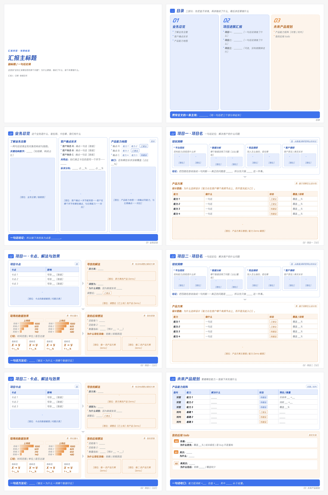

# report-deck-builder

做**答辩 / 述职 / 项目汇报 / PRD 沟通稿**的可视化 HTML：一份可直接用的模板 + 一套固定设计规范 + 一键导出可编辑 PPT 与零弹窗 PDF。

模板是 8 页 4:3（1044×783），内容全是占位文案，复制即可开始填。



*示意图为模板默认占位内容（封面 / 目录 / 01 业务总览 / 02 项目一（2 页）/ 02 项目二（2 页）/ 03 未来产品规划）。*

## 快速开始

```bash
cp assets/汇报材料通用模板.html  你的目录/<材料名>.html
```

然后在浏览器打开，点工具条：

| 按钮 | 作用 |
|---|---|
| **开启编辑** | 所有虚线框文字可直接改，⌘S / 「保存 HTML」下载覆盖 |
| **历史版本** | 左栏快照，可就地改名、随时回滚 |
| **下载 PDF** | 一键直出，**不弹任何窗口**（横向 4:3 / 无边距 / 3 倍高清 ≈300dpi） |
| **下载 PPT** | 导出**可编辑**的原生 PPT（文本框/形状/表格，不是截图），字体可选腾讯体 / 苹方 / 微软雅黑 |

图位放图：**点一下虚线图位，再 ⌘V 粘贴截图**（原图不压缩）。

## 页面结构

```
封面 / 目录 / 01 业务总览 / 02 项目一（洞察方案 + 卡点解法效果）
/ 02 项目二（同结构）/ 03 未来规划
```

加项目 = 整块复制项目一那两页（有 `<!-- ============ 02 项目X ... -->` 注释锚点）；不要的页整块删掉。

项目页固定 **7 段叙事**，别写成功能清单：
`现状洞察 → 产品方案 → 项目卡点 → 寻找的解法 → 取得的数据效果 → 我的后续想法 → 一句话方法论`

## 设计规范（摘要）

**配色**：蓝 + 橙

```
主蓝 #3E71EC  深蓝文字 #2450B8  浅蓝底 #E6EEFE  次级浅蓝 #CBDCFC  描边蓝 #A1BDFA
主橙 #E98E40  深橙文字 #B4621E  浅橙底 #FDF4EC
页面底 #F6F6F6  卡片 #FFFFFF  正文 #1F2329  次要 #646A73  边框 #E5E6EB
```

**语义映射**

- 【因】蓝：现状洞察 / 业务全貌 / 客户诉求 / 项目卡点
- 【果】橙：产品方案 / 寻找的解法 / 数据效果 / 我的后续想法
- 对客能力 = 蓝，对内基建 = 橙
- 状态只分两态、用边框区分：已建设 = 实线，待建设 = 虚线
- 橙块内的表格表头 / 漏斗 / 图位都跟随橙色
- 因 → 果 之间加灰色箭头（`#C9CDD4`）：上下排向下、左右排向右
- 目录页按章性质配色：业务总览=蓝、项目进展=蓝、未来规划=橙

**字号**（h2 25 / 卡片标题 17.5 / 正文 15.5 / 列表·表格 15 / 结论 16 / 指标数值 22 / 图位说明 14 / 页码·chip 13.5 / 状态标签 13）

**字体**全站腾讯体；**页面**统一 4:3；**图片**不自动压缩。

完整规范、踩坑清单与导出实现细节见 `SKILL.md` 和 `references/导出与还原度.md`。

## 目录

```
.
├── README.md
├── SKILL.md                      规范 + 工作流 + 踩坑（技能正文）
├── assets/汇报材料通用模板.html    模板母版（改完记得同步回这里）
├── references/导出与还原度.md     一键直出 PDF / DOM→PPT 陷阱 / 还原度核对清单
└── docs/preview.png              8 页示意图
```

## 更新

改完模板后把 `assets/汇报材料通用模板.html` 一并提交，保证下次从仓库拿到的就是最新版。
